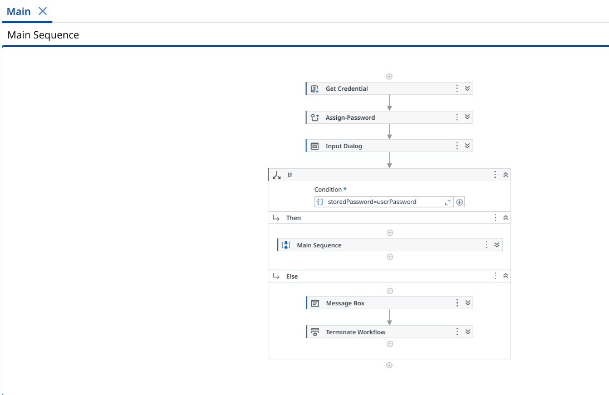
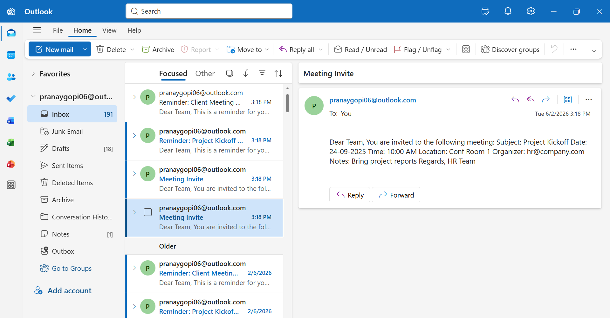
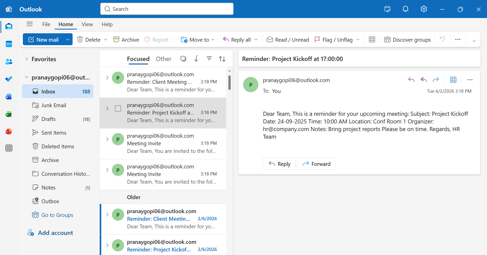

# Meeting Invite and Reminder Automation

## Overview

Meeting Invite and Reminder Automation is an enterprise-oriented Robotic Process Automation (RPA) solution developed using UiPath, Microsoft Outlook, and Microsoft Excel. The solution automates the end-to-end process of meeting scheduling, invitation distribution, reminder notifications, and activity tracking, significantly reducing manual effort and improving operational efficiency.

This automation is designed to support HR teams, project coordinators, administrative departments, and business operations teams that frequently manage meetings across multiple stakeholders.

---

## Business Problem

Organizations often spend considerable time manually creating meeting invitations, sending follow-up reminders, updating spreadsheets, and maintaining communication records. As the number of meetings increases, the process becomes repetitive, error-prone, and time-consuming.

Common challenges include:

* Manual creation of Outlook meeting invitations
* Missed or delayed reminder communications
* Inconsistent tracking of invitation status
* Lack of centralized logging and reporting
* Increased administrative overhead

---

## Solution

This UiPath automation eliminates repetitive scheduling tasks by automatically reading meeting information from Excel, generating Outlook meeting invitations, sending reminder emails, and maintaining activity logs.

The solution operates in two phases:

### Phase 1 – Automated Meeting Invitation Distribution

* Reads meeting information from Excel
* Identifies meetings that have not yet been processed
* Generates Outlook meeting invitations automatically
* Sends invitations to all specified attendees
* Updates invitation status in the source file

### Phase 2 – Automated Reminder Notification System

* Identifies meetings scheduled for the current day
* Generates reminder emails automatically
* Sends reminders to meeting participants
* Creates and maintains reminder logs
* Ensures communication consistency

---

## Key Features

### Automated Meeting Scheduling

Automatically creates Outlook meeting invitations using predefined meeting information.

### Intelligent Reminder Notifications

Sends meeting reminders on the scheduled date without manual intervention.

### Excel-Driven Configuration

Business users can manage meeting schedules directly through Excel without modifying automation logic.

### Activity Tracking and Logging

Maintains records of invitations and reminders for audit and monitoring purposes.

### Reusable Workflow Architecture

Designed using modular UiPath workflows for maintainability and scalability.

### Reduced Manual Effort

Minimizes repetitive administrative tasks and improves operational productivity.

---

## Technology Stack

| Technology          | Purpose                            |
| ------------------- | ---------------------------------- |
| UiPath Studio       | Process Automation Development     |
| Microsoft Outlook   | Invitation & Reminder Distribution |
| Microsoft Excel     | Meeting Data Management            |
| Windows Environment | Automation Execution Platform      |

---

## Project Architecture

```text
Meetings.xlsx
       │
       ▼
UiPath Automation
       │
       ├── Validate Meeting Data
       │
       ├── Generate Outlook Invitations
       │
       ├── Update Invitation Status
       │
       ├── Identify Today's Meetings
       │
       ├── Send Reminder Emails
       │
       └── Create Reminder Logs
               │
               ▼
      MeetingReminderLog.xlsx
```

---

## Workflow Components

### Main.xaml

Orchestrates the complete automation process and controls workflow execution.

### Send_Meeting_Invites.xaml

Handles invitation creation and Outlook communication.

### Send_Reminder_1.xaml

Processes reminder generation logic.

### Send_Reminder_2.xaml

Executes reminder workflow operations.

### Send_Reminder_Mails.xaml

Manages email reminder distribution.

---

## Input Data Structure

### Meetings.xlsx

Required fields:

* Meeting ID
* Subject
* Date
* Time
* Duration
* Organizer
* Attendees
* Location
* Agenda / Notes
* Invite Sent Status

---

## Output Deliverables

### Outlook Meeting Invitations

Automatically distributed to attendees.

### Reminder Emails

Generated and delivered on the meeting date.

### Updated Meetings.xlsx

Invitation status updated automatically.

### MeetingReminderLog.xlsx

Tracks reminder communication history.

---

## Screenshots

### Main Workflow



### Input Data Sheet


### Meeting Invitation Sent



### Reminder Email Sent



---

## Benefits

* Reduced manual scheduling effort
* Improved communication consistency
* Faster meeting coordination
* Better operational visibility
* Enhanced process reliability
* Increased workforce productivity

---

## Future Enhancements

* UiPath Orchestrator Integration
* Unattended Bot Deployment
* Microsoft Teams Integration
* Google Calendar Integration
* Automated Exception Handling
* Dashboard and Reporting Module
* Database Integration
* Multi-user Scheduling Support

---

## Author

### Pranay Gopi

Technology Enthusiast | Software Developer | Automation & AI Practitioner

Passionate about building impactful technology solutions across automation, software development, artificial intelligence, and digital transformation. I enjoy designing systems that streamline processes, enhance productivity, and solve real-world challenges through innovation.

My interests span Robotic Process Automation (RPA), AI Agents, Software Engineering, Cybersecurity, Digital Systems, and Technology Entrepreneurship. I actively explore emerging technologies and apply them through hands-on projects that combine technical excellence with practical business value.

Committed to continuous learning, innovation, and creating solutions that make technology more accessible, efficient, and meaningful.
